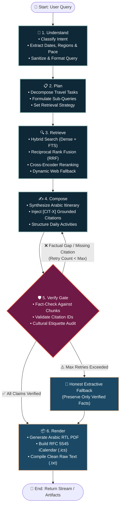
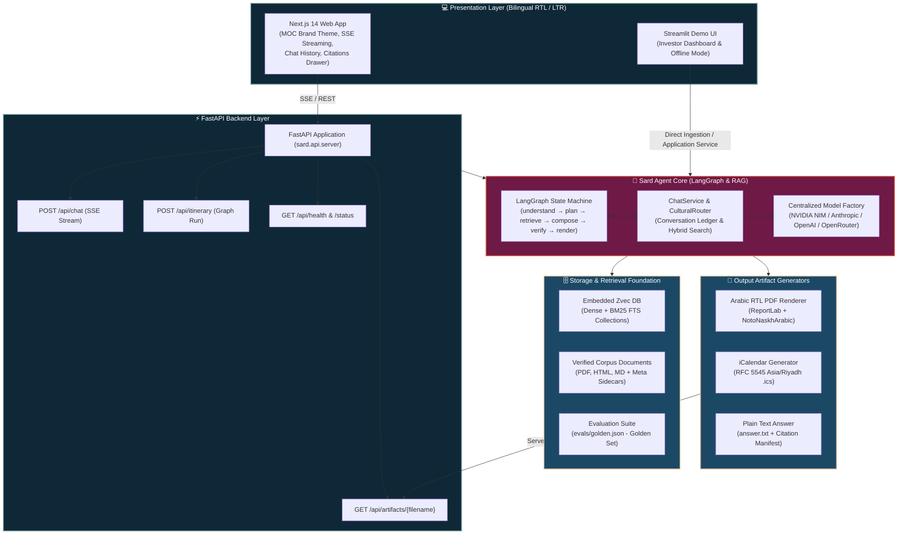

# Sard (سرد) — Arabic-First Saudi Cultural & Travel Assistant

<p align="center">
  
</p>

<p align="center">
  <strong>سرد | المساعد الذكي الموثوق للسياحة والتراث الثقافي في المملكة العربية السعودية</strong><br>
  <em>An enterprise-grade, culturally grounded AI agent tailored for Saudi cultural heritage, regional tourism itineraries, etiquette, and authentic traditions.</em>
</p>

<p align="center">
  
  
  
  
  
  
  
</p>

---

## 📖 Table of Contents

1. [Overview & Core Philosophy](#-overview--core-philosophy)
2. [Agent Architecture & How It Works](#-agent-architecture--how-it-works)
   - [LangGraph Agent Pipeline](#1-langgraph-agent-pipeline-mermaid)
   - [Hybrid Cultural Retrieval & Routing](#2-hybrid-cultural-retrieval--routing-mermaid)
   - [End-to-End System Architecture](#3-end-to-end-system-architecture-mermaid)
3. [Key Features](#-key-features)
4. [Project Structure](#-project-structure)
5. [LangGraph Execution Lifecycle](#-langgraph-execution-lifecycle)
6. [Cultural Grounding & Citation Engine](#-cultural-grounding--citation-engine)
7. [Deterministic RTL & Calendar Outputs](#-deterministic-rtl--calendar-outputs)
8. [Web & UI Interfaces](#-web--ui-interfaces)
9. [Getting Started & Installation](#-getting-started--installation)
10. [Running the Application](#-running-the-application)
11. [CLI Commands Reference](#-cli-commands-reference)
12. [Evaluation & Diagnostics](#-evaluation--diagnostics)
13. [Configuration & Environment Variables](#-configuration--environment-variables)
14. [License & Font Notices](#-license--font-notices)

---

## 🌟 Overview & Core Philosophy

**Sard (سرد)** is an intelligent, culturally authentic travel and heritage assistant built specifically for Saudi Arabia and the Arabian Gulf. Unlike generic chatbots that hallucinate cultural traditions or flatten regional nuances, Sard adheres to strict factual grounding, source verification, and Arabic-first typography.

### Core Architectural Pillars:
* **Zero Hallucination Policy:** Every cultural statement and itinerary recommendation is verified against indexed heritage documents (`[RAG: filename]`) or verifiable real-time sources (`[Web: url]`).
* **Respectful Cultural Grounding:** Distinguishes between religious obligations, regional customs (Najd, Hejaz, Eastern Province, Asir, etc.), and modern urban practices. Never generalizes or trivializes traditions.
* **Deterministic Artifact Generation:** Produces verified, pixel-perfect Arabic RTL PDFs (`ReportLab` + `NotoNaskhArabic`), RFC 5545 iCalendar files (`.ics` with `Asia/Riyadh` timezone), and raw text summaries.
* **Resilient Multi-Tier Fallbacks:** Centralized model routing supporting NVIDIA NIM, Anthropic Claude, OpenAI, and OpenRouter with automatic graceful degradation to extractive summaries if external APIs fail.
* **Ministry of Culture (MOC) Brand Identity:** Production Next.js 14 interface matching the official Saudi Ministry of Culture guidelines (Dark Navy `#0F2837`, Plum `#6E1946`, Coral `#EB5A3C`, Sage `#91B9B4`, Peach `#FAC39B`).

---

## 🧠 Agent Architecture & How It Works

### 1. LangGraph Agent Pipeline (Mermaid)

The Sard agent core executes a stateful, cyclical LangGraph workflow. Claims generated in the `compose` node must pass the strict `verify` gate before reaching `render`. If verification finds unsupported assertions or citation errors, it loops back to `compose` with corrective feedback (up to `compose_max_retries`).



---

### 2. Hybrid Cultural Retrieval & Routing (Mermaid)

Sard combines an embedded, local vector database (`Zvec`) with an intelligent, budget-capped search router (`CulturalRouter`) to ensure speed, offline reliability, and freshness for live events.

```mermaid
flowchart LR
    Query([Query: User Prompt]) --> Router{"Cultural Router<br/>Evaluation"}
    
    subgraph LocalRAG ["📚 Local Knowledge Base (Always-On)"]
        ZvecDense["Dense Vector Search<br/>(Nemotron / NV-Embed)"]
        ZvecFTS["BM25 Full-Text Search<br/>(Arabic Normalization)"]
        RRF["Reciprocal Rank Fusion<br/>(RRF Score)"]
        Reranker["Cross-Encoder Reranker<br/>(Mistral Rerank / Fallback)"]
        
        ZvecDense & ZvecFTS --> RRF --> Reranker
    end
    
    Router -->|"1. Always Run First"| LocalRAG
    
    subgraph DecisionEngine ["⚖️ Routing Decision Rules"]
        Rule1{"High Confidence<br/>In Corpus?<br/>(Score >= 0.65)"}
        Rule2{"Time-Sensitive /<br/>Freshness Needed?<br/>(e.g., 2026 events)"}
        Rule3{"Corpus Missing<br/>Region / Topic?"}
    end
    
    Reranker --> DecisionEngine
    
    subgraph WebExpansion ["🌐 Parallel Web Search (Capped Budget)"]
        ParallelSearch["Parallel Search<br/>(Max 2 Requests)"]
        ParallelExtract["Parallel Extract<br/>(Max 1 URL)"]
        SourcePolicy["Cultural Source Policy<br/>(Prefer Local / Official Sources)"]
        
        ParallelSearch --> ParallelExtract --> SourcePolicy
    end
    
    DecisionEngine -- "Yes (In Corpus & Stable)" --> Synthesis["Answer Synthesis<br/>• Tag [RAG: doc.pdf]<br/>• Tag [Web: url]<br/>• Flag Cross-Source Disagreements"]
    DecisionEngine -- "Freshness Required / Low RAG Score" --> WebExpansion --> Synthesis
    
    Synthesis --> OutputResult([Final Cited Output])

    classDef box fill:#0F2837,stroke:#91B9B4,stroke-width:2px,color:#fff;
    classDef router fill:#6E1946,stroke:#FAC39B,stroke-width:2px,color:#fff;
    class LocalRAG,WebExpansion,DecisionEngine box;
    class Router,Synthesis router;
```



---

### 3. End-to-End System Architecture (Mermaid)



---

## 🚀 Key Features

| Capability | Description |
|---|---|
| **🇸🇦 Authentic Saudi Cultural Grounding** | Custom-built knowledge base covering regional heritage (Al-Ahsa hot springs, Tarout Island shrimp drying, Asir architecture, Najdi hospitality, etiquette, and attire). |
| **🛡️ 6-Stage LangGraph Pipeline** | Fully deterministic orchestration (`understand` ➔ `plan` ➔ `retrieve` ➔ `compose` ➔ `verify` ➔ `render`) with retry loops and structured failure classification. |
| **📑 True Arabic RTL PDF Generation** | Custom ReportLab engine with BiDi reshaping, character joining, margin wrapping, header/footer isolation, and inline footnote citations using pinned `NotoNaskhArabic` fonts. |
| **📅 RFC 5545 iCalendar (`.ics`)** | Generates importable travel calendars with accurate date/time arithmetic in the `Asia/Riyadh` timezone. |
| **🔍 Always-On Hybrid RAG (Zvec)** | Local embedded vector storage combining dense embeddings (Nemotron-3 / NV-Embed) with BM25 full-text search and cross-encoder reranking. |
| **🌐 Dynamic Cultural Router** | Automatically detects time-sensitive queries ("2026 events", "current schedule") or out-of-corpus topics and triggers capped web search while prioritizing regional Gulf sources. |
| **🎨 Saudi Ministry of Culture UI** | Beautiful Next.js 14 web application styled to official MOC March 2019 guidelines, featuring real-time SSE streaming, collapsible citation cards, and one-click artifact downloads. |
| **🔌 Provider-Neutral Multi-LLM** | Seamlessly toggle between NVIDIA NIM, Anthropic Claude 3.5, OpenAI GPT-4o, and OpenRouter without changing business logic. |
| **🧪 420+ Automated Tests** | Comprehensive test coverage across agent nodes, RAG retrieval, PDF formatting, calendar parsing, API endpoints, and failure redaction. |

---

## 📂 Project Structure

```text
Sard_Agent/
├── sard/                           # Core Python Package
│   ├── agent/                      # LangGraph & Agent Orchestration
│   │   ├── nodes/                  # Pipeline Stage Handlers
│   │   │   ├── understand.py       # Query understanding, entity extraction & intent classification
│   │   │   ├── plan.py             # Strategic travel task planning & sub-query generation
│   │   │   ├── retrieve.py         # Multi-source retrieval & rank fusion
│   │   │   ├── compose.py          # Grounded Arabic itinerary & answer synthesis
│   │   │   ├── verify.py           # Verification gate, citation checking & etiquette audit
│   │   │   └── render.py           # Multi-artifact render dispatcher
│   │   ├── tools/                  # Cultural & Retrieval Tooling
│   │   │   └── cultural_tools.py   # RAG search, parallel search, and parallel extract tools
│   │   ├── cultural_router.py      # Hybrid RAG + Web routing decision engine & prompt synthesis
│   │   ├── chat_service.py         # Conversation state manager with message history & status tracking
│   │   ├── graph.py                # LangGraph pipeline builder, node wiring & conditional edges
│   │   ├── state.py                # Typed GraphState definitions and lifecycle mutations
│   │   ├── routing.py              # Failure classification & retry routing logic
│   │   └── events.py               # Telemetry events & progress streaming helpers
│   ├── api/                        # Backend API Server
│   │   └── server.py               # FastAPI server with SSE streaming (/api/chat) & artifact endpoints
│   ├── application/                # Unified Application Services & Demo Caching
│   │   ├── service.py              # Application service coordinating graph execution & streaming
│   │   ├── demo.py                 # Precached deterministic investor demo harness
│   │   └── demo_cache/             # Golden demo artifacts (itinerary.pdf, itinerary.ics, answer.txt)
│   ├── cli/                        # Command Line Interfaces
│   │   ├── agent.py                # 'sard-agent' CLI for pipeline execution & offline traces
│   │   ├── api.py                  # 'sard-api' CLI server runner
│   │   ├── demo.py                 # 'sard-demo' investor demo gate & evaluation CLI
│   │   └── rag.py                  # 'sard-rag' corpus ingestion, search & diagnostic tool
│   ├── config/                     # Centralized Configurations
│   │   ├── models.py               # Multi-provider LangChain chat model factory (NVIDIA, Anthropic, OpenAI)
│   │   └── rag.py                  # RAG settings, embedding dimensions & Zvec store paths
│   ├── outputs/                    # Deterministic Artifact Renderers
│   │   ├── assets/                 # Bundled TrueType Fonts (NotoNaskhArabic, NotoSans) & OFL license
│   │   ├── arabic.py               # Arabic text reshaping and python-bidi bidirectional layout
│   │   ├── pdf.py                  # ReportLab RTL PDF renderer with footnote citations
│   │   ├── calendar.py             # RFC 5545 iCalendar (.ics) generator with Asia/Riyadh timezone
│   │   ├── raw.py                  # Formatted raw text builder (answer.txt)
│   │   ├── validation.py           # Pre-rendering validation for citations & unsupported fields
│   │   └── schemas.py              # Itinerary, Activity, and RenderedArtifact contracts
│   ├── rag/                        # RAG Foundation Subsystem
│   │   ├── zvec_store.py           # Embedded Zvec vector store wrapper (dense + BM25 FTS)
│   │   ├── ingest.py               # Resumable, idempotent corpus ingestion engine
│   │   ├── loaders.py              # Robust PDF, HTML, Markdown & plain-text document loaders
│   │   ├── normalize.py            # Arabic orthographic normalization (Alef, Taa Marbuta, Tashkeel)
│   │   ├── chunking.py             # Section-aware Arabic document chunking with metadata inheritance
│   │   ├── query_rewriter.py       # Multi-query rewriting & normalization
│   │   ├── rerank.py               # Cross-encoder reranking & RRF rank fusion
│   │   ├── evaluate.py             # Retrieval evaluation suite (Recall@K, MRR, nDCG)
│   │   └── service.py              # Public, provider-independent RAGService boundary
│   └── ui/                         # Streamlit User Interface
│       ├── app.py                  # Streamlit web application with live & cached demo modes
│       └── presentation.py         # Arabic typography & presentation helpers
├── web/                            # Next.js 14 Frontend Web Application
│   ├── src/
│   │   ├── app/                    # Next.js App Router (layout.tsx, page.tsx, globals.css)
│   │   ├── components/             # React Components (Header, Sidebar, ChatMessages, Composer, Landing)
│   │   ├── lib/                    # Storage, sectors, and Arabic text utilities
│   │   └── types/                  # TypeScript interface contracts for chat, citations, and artifacts
│   ├── public/                     # Static assets and MOC brand images
│   ├── tailwind.config.js          # Tailwind configuration with official MOC brand palette
│   └── package.json                # Frontend dependencies (React, Lucide, Tailwind)
├── data/                           # Data Directories
│   ├── corpus/                     # Verified Saudi cultural documents & sidecar JSON metadata
│   │   ├── MANIFEST.md             # Corpus catalog and verified source registry
│   │   └── *.meta.json             # Source sidecar metadata (URLs, titles, dates)
│   └── zvec/                       # Generated local Zvec vector collections (git-ignored)
├── evals/                          # Evaluation Data & Test Suites
│   ├── golden.json                 # Golden evaluation benchmark dataset
│   └── test_cultural_search_rag.py # Cultural search and RAG routing validation suite
├── docs/                           # Documentation & Runbooks
│   ├── demo-runbook.md             # Presenter steps, backup procedures & deployment guide
│   ├── demo-script.md              # Investor demo narrative & prompt scripts
│   └── final-evaluation.md         # Benchmark results & corpus coverage audit
├── tests/                          # 420+ Unit and Integration Tests
├── pyproject.toml                  # Python package configuration & dependencies
├── Dockerfile                      # Production Docker container definition
└── README.md                       # Master Documentation (this file)
```

---

## 🔄 LangGraph Execution Lifecycle

When a travel query is received, Sard executes a 6-stage lifecycle:

```text
[Input Query] ➔ Understand ➔ Plan ➔ Retrieve ➔ Compose ➔ Verify ➔ Render ➔ [Artifacts & Stream]
                                                    ▲       │
                                                    └──Retry┘
```

1. **`understand` Node:**
   - Analyzes user input to identify: primary Saudi region, trip duration, traveler pace (relaxed, moderate, active), companions (family, solo, cultural enthusiast), and budget/interests.
   - Cleans and normalizes Arabic text while preserving core entities.

2. **`plan` Node:**
   - Breaks down the query into structured sub-tasks: historical background lookup, daily geographical routing, culinary recommendations, and cultural etiquette advisories.

3. **`retrieve` Node:**
   - Executes multi-stage retrieval against the `Zvec` store:
     - **Dense Vector Search:** Semantic matching using dense embeddings.
     - **BM25 Full-Text Search (FTS):** Keyword matching over normalized Arabic text.
     - **Reciprocal Rank Fusion (RRF):** Blends rank positions from both methods.
     - **Cross-Encoder Reranking:** Applies Mistral Rerank to select the top-K relevant chunks.
   - If freshness is required or corpus coverage is insufficient, invokes the `CulturalRouter` web search.

4. **`compose` Node:**
   - Synthesizes a cohesive, chronologically structured Arabic itinerary.
   - Embeds strict source citation tokens (e.g., `[CIT-3AE406450E19]`).
   - Ensures activities have realistic durations and regional geographical coherence.

5. **`verify` Node (The Safety & Quality Gate):**
   - **Fact Extraction:** Audits every factual claim (opening hours, locations, traditions).
   - **Citation Alignment:** Verifies that every `[CIT-X]` corresponds to an existing chunk containing the referenced fact.
   - **Etiquette Audit:** Ensures cultural guidance adheres to Saudi heritage norms.
   - **Decision:** If hallucinated claims or broken citations are found, triggers a retry loop back to `compose` with corrective instructions. If retries are exhausted, falls back to a deterministic extractive summary.

6. **`render` Node:**
   - Dispatches the verified itinerary to the artifact generators (`pdf.py`, `calendar.py`, `raw.py`).
   - Packages metadata, file paths, and checksums for immediate streaming to the client.

---

## 🛡️ Cultural Grounding & Citation Engine

Sard implements strict cultural grounding rules to ensure respect and factual authenticity:

### Citation Syntax
* **Local Knowledge Base Documents:** Displayed as `[RAG: Document Title]` (e.g., `[RAG: ينابيع_الأحساء_السياحية.pdf]`).
* **Live Web Sources:** Displayed as `[Web: URL]` (e.g., `[Web: https://www.visitsaudi.com/...]`).
* **Conflict Flagging:** If historical or modern sources disagree on a tradition or timing, Sard explicitly presents both perspectives with their respective citations rather than choosing arbitrarily.

### Etiquette & Respect Principles
* **Regional Specificity:** Distinguishes between Najdi, Hejazi, Eastern, Southern, and Northern customs. Does not homogenize Saudi culture into a single generic stereotype.
* **Religious vs. Cultural Nuance:** Separates Islamic requirements (e.g., prayer times, Ramadan observance) from traditional regional customs and modern hospitality etiquette.
* **Practical Advice:** Provides actionable etiquette guidance (greetings, attire expectations, coffee service etiquette) rather than superficial trivia.

---

## 📑 Deterministic RTL & Calendar Outputs

### 1. Arabic RTL PDF Renderer (`sard/outputs/pdf.py`)
* **True RTL Reshaping:** Uses `arabic-reshaper` and `python-bidi` for correct glyph joining and directionality.
* **Pinned Fonts:** Bundles the SIL Open Font Licensed `NotoNaskhArabic` and `NotoSans` fonts directly in `sard/outputs/assets/` to ensure deterministic rendering on any operating system without system font dependencies.
* **Page Layout:** Clean A4 portrait layout with non-overlapping headers, dynamic margins, formatted daily activity cards, and isolated bottom footnote citations.

### 2. RFC 5545 iCalendar (`sard/outputs/calendar.py`)
* Built with `icalendar` (pinned to 7.2.x line).
* Generates timezone-aware `VEVENT` items in the `Asia/Riyadh` timezone (`UTC+03:00`).
* Calculates precise start and end times for each itinerary activity and embeds source citations in event descriptions.

---

## 🎨 Web & UI Interfaces

### Next.js 14 Web Application
The production web application is located in `web/` and features:
* **MOC Brand Palette:** Built using the official Saudi Ministry of Culture colors:
  * **Primary Dark Navy:** `#0F2837`
  * **Accent Plum:** `#6E1946`
  * **Highlight Coral:** `#EB5A3C`
  * **Muted Sage:** `#91B9B4`
  * **Warm Peach:** `#FAC39B`
* **Real-time SSE Streaming:** Live streaming token delivery from `/api/chat`.
* **Collapsible Citations Drawer:** Interactive cards displaying the source title, URL, snippet, and confidence.
* **One-Click Downloads:** Download generated PDF itineraries and `.ics` calendars directly from chat messages.
* **Session Persistence:** Persistent chat history stored in local storage with search and session management.

### Streamlit Investor Demo
The Streamlit application in `sard/ui/app.py` provides:
* **Live Mode:** Connects to live NVIDIA NIM endpoints for real-time generation and retrieval.
* **Precached Demo Mode:** Deterministic, offline investor demonstration using verified golden fixtures.
* **Diagnostic Panel:** Inspects dense vs. FTS candidate scores, reranking weights, and node execution latencies.

---

## ⚙️ Getting Started & Installation

### Prerequisites
* **Operating System:** Linux, macOS, or Windows (10/11)
* **Python:** Version `3.11` or newer
* **uv:** Fast Python package and environment manager ([Install uv](https://github.com/astral-sh/uv))
* **Node.js & npm:** Node.js 18+ (for running the Next.js web frontend)

### Installation Steps

1. **Clone the Repository:**
   ```bash
   git clone https://github.com/NBTON/Sard.git
   cd Sard
   ```

2. **Set Up Python Environment with `uv`:**
   ```bash
   # Install all dependencies including dev and provider packages
   uv sync --extra nvidia --extra anthropic --extra openai --extra dev
   ```

3. **Configure Environment Variables:**
   ```bash
   # On Linux / macOS:
   cp .env.example .env

   # On Windows (PowerShell):
   Copy-Item .env.example .env
   ```
   *Edit `.env` to supply your API keys (e.g. `NVIDIA_API_KEY`, `ANTHROPIC_API_KEY`, or `OPENAI_API_KEY`).*

4. **Install Frontend Dependencies:**
   ```bash
   cd web
   npm install
   cd ..
   ```

---

## 🏃 Running the Application

### Option 1: Full-Stack Web Application (FastAPI + Next.js)

1. **Start the FastAPI Backend Server:**
   ```bash
   uv run sard-api
   ```
   *Server starts at `http://127.0.0.1:8000` (API documentation at `http://127.0.0.1:8000/docs`).*

2. **Start the Next.js Frontend:**
   ```bash
   cd web
   npm run dev
   ```
   *Open `http://localhost:3000` in your web browser.*

---

### Option 2: Streamlit Investor Demo UI

```bash
uv run streamlit run sard/ui/app.py
```
*Open `http://localhost:8501` to test both Live execution and Precached offline demonstration.*

---

### Option 3: Offline Demo Runner via CLI

Run the deterministic, network-free LangGraph demo trace:
```bash
uv run sard-agent --demo --render --date 2026-11-01 --date 2026-11-02
```

---

## 🛠️ CLI Commands Reference

Sard provides comprehensive command-line interfaces for administration, RAG management, and testing:

### 1. Agent CLI (`sard-agent`)
```bash
# Run a live travel query through the LangGraph pipeline
uv run sard-agent "أنشئ برنامجًا سياحيًا تراثيًا لمدة يومين في المنطقة الشرقية"

# Run the deterministic hero-query demo trace
uv run sard-agent --demo

# Run demo with artifact rendering and custom dates
uv run sard-agent --demo --render --date 2026-10-15 --date 2026-10-16
```

### 2. RAG Foundation CLI (`sard-rag` or `python -m sard.cli.rag`)
```bash
# Verify system configuration and API reachability
uv run python -m sard.cli.rag doctor

# Discover available models from your provider
uv run python -m sard.cli.rag models

# Create/initialize the local Zvec vector collection
uv run python -m sard.cli.rag create-collection

# Ingest corpus documents into the vector store
uv run python -m sard.cli.rag ingest data/corpus

# Perform hybrid search test
uv run python -m sard.cli.rag hybrid-search "أين تقع الينابيع الحارة في الأحساء؟" --k 5

# Ask a direct question via the RAG service
uv run python -m sard.cli.rag ask "ما هي أهم المعالم التراثية في جزيرة تاروت؟"
```

### 3. Investor Demo & Evaluation CLI (`sard-demo`)
```bash
# Check readiness gate for the demo
uv run sard-demo check

# Run evaluation benchmark against golden dataset
uv run sard-demo evaluate --json-out output/evaluation/final-evaluation.json
```

---

## 🧪 Evaluation & Diagnostics

Sard includes a robust diagnostic and evaluation harness to objectively grade retrieval quality and verification accuracy.

### Running Unit & Integration Tests
```bash
# Run the complete test suite (426+ offline tests)
uv run pytest -q

# Run live network smoke tests (requires active API credentials)
$env:RAG_LIVE_SMOKE="true"; uv run pytest -q -m live   # PowerShell
RAG_LIVE_SMOKE=true uv run pytest -q -m live           # Linux/macOS
```

### RAG Evaluation Metrics
```bash
uv run python -m sard.cli.rag evaluate evals/golden.json --k 6
```
The evaluation report calculates:
* **Recall@K:** For Dense, BM25 FTS, Fused (RRF), and Reranked stages.
* **MRR (Mean Reciprocal Rank):** Measuring first relevant item position.
* **nDCG:** Normalized Discounted Cumulative Gain over graded relevance.
* **Citation Grounding Rate:** Percentage of generated claims backed by verifiable corpus chunk IDs.

---

## ⚙️ Configuration & Environment Variables

Key settings in `.env`:

```dotenv
# --- LLM Provider Selection ---
# Options: "nvidia", "anthropic", "openai", "openrouter"
MODEL_PROVIDER=nvidia
MODEL_NAME=nemotron-3-super-120b-a12b
MODEL_TEMPERATURE=0.2

# --- Provider Credentials ---
NVIDIA_API_KEY=nvapi-...
ANTHROPIC_API_KEY=sk-ant-...
OPENAI_API_KEY=sk-...

# --- Self-Hosted NVIDIA NIM Endpoints (Optional) ---
# NVIDIA_CHAT_BASE_URL=http://chat-nim:8000/v1
# NVIDIA_EMBEDDING_BASE_URL=http://embed-nim:8000/v1
# NVIDIA_RERANK_BASE_URL=http://rerank-nim:8000/v1

# --- Vector Database & Corpus Paths ---
ZVEC_COLLECTION_PATH=data/zvec/sard-default
CORPUS_ROOT=data/corpus
SARD_PDF_OUTPUT_ROOT=output/runs

# --- Agent Settings ---
AGENT_COMPOSE_MAX_RETRIES=2
AGENT_RENDER_ARTIFACTS=true
```

---

## 📜 License & Font Notices

* **Codebase License:** MIT License. See [LICENSE](LICENSE) for details.
* **Typography:** Bundles `Noto Naskh Arabic` and `Noto Sans` distributed under the **SIL Open Font License 1.1** ([OFL.txt](sard/outputs/assets/OFL.txt)).
* **Brand Identity:** Styled in reverence to the official brand guidelines of the **Ministry of Culture, Kingdom of Saudi Arabia**.

---

<p align="center">
  صُنع بكل فخر لخدمة التراث والثقافة السعودية 🇸🇦<br>
  <em>Engineered with pride to celebrate and preserve Saudi cultural heritage.</em>
</p>
