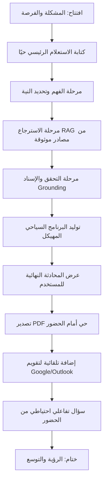

# سرد (Sard) — سكربت العرض التوضيحي للمستثمرين
### Demo Script v0.1 — MVP Investor Walkthrough

> **ملاحظة حول المصداقية:** كل حقيقة تراثية أو تاريخية أو رقمية واردة في هذا المستند هي إما (أ) معلومة عامة موثقة على نطاق واسع، أو (ب) مثال توضيحي مُعلَّم صراحة بعبارة **[مثال توضيحي — يتطلب تحققًا]**. يُمنع على فريق العرض أو على النظام نفسه تقديم أي عنصر من الفئة (ب) للجمهور كحقيقة قاطعة.

---

## 1. الهدف من العرض

إظهار أن سرد قادر على تحويل استعلام سياحي واحد بالعربية الفصحى إلى **برنامج سياحي تراثي كامل، موثّق المصادر، وقابل للاستخدام فورًا** (محادثة + ملف PDF + إضافة تلقائية للتقويم)، خلال جلسة حية لا تتجاوز 4–5 دقائق، مع إبراز أن النظام **لا يهلوسن الحقائق التراثية** — وهي أكبر مخاطرة ثقة في هذه الفئة من المنتجات.

الرسالة الاستثمارية المحورية: *"سرد ليس روبوت دردشة سياحي عام مُعرَّب — إنه طبقة موثوقية (grounding layer) فوق التراث السعودي، مبنية لتُصدِّق عليها هيئة السياحة والمستخدم المحلي على حدٍ سواء."*

---

## 2. الاستعلامات

### الاستعلام الرئيسي (Hero Query)
```
أنشئ برنامجًا سياحيًا تراثيًا لمدة يومين في المنطقة الشرقية
```
هذا هو الاستعلام الذي يُبنى عليه العرض الرئيسي بالكامل (القسم 3–5).

### الاستعلامات الاحتياطية (Backup Queries)
تُستخدم في حال تعطل الشبكة، أو ضعف نتائج الاسترجاع على الاستعلام الرئيسي وقت العرض، أو لأسئلة تفاعلية من الحضور.

| # | الاستعلام | الغرض |
|---|-----------|-------|
| B1 | `ما هي أبرز المواقع التراثية السعودية المسجلة في قائمة اليونسكو للتراث العالمي؟` | استعلام معرفي عام آمن (حقائق موثقة رسميًا)، مثالي إن طُلب "أرنا سؤالًا أبسط" |
| B2 | `اقترح خطة زيارة ليوم واحد لاستكشاف حي الطريف التاريخي في الدرعية` | استعلام إقليم مختلف (وسط السعودية) لإثبات أن النظام ليس مبنيًا حصريًا على المنطقة الشرقية |

**قاعدة تشغيل:** لا يُستخدم أي استعلام غير هذه الثلاثة في العرض المباشر أمام مستثمرين إلا بعد اختباره في evals/golden.json أو ما يعادله.

---

## 3. تدفق العرض خطوة بخطوة (Demo Flow)



### تفصيل المراحل:
1. **الافتتاح (30 ثانية):** جملة واحدة عن المشكلة — السائح المحلي أو الدولي الناطق بالعربية لا يجد مخططًا سياحيًا تراثيًا موثوقًا وجاهزًا للاستخدام، بل نتائج بحث متناثرة أو غير موثوقة.
2. **كتابة الاستعلام حيًا (لا نسخ/لصق):** يكتب العارض الاستعلام الرئيسي أمام الجمهور لإثبات أنه تفاعل حقيقي وليس تسجيلًا.
3. **مراحل الأنابيب (Pipeline):** تُعرض تباعًا (تفصيل كامل في القسم 4).
4. **العرض النهائي:** محادثة + PDF + تقويم (تفصيل في القسم 5).
5. **الختام (30–45 ثانية):** خارطة الطريق (توسع لمناطق أخرى، شراكات مع الهيئة السعودية للسياحة، لغات إضافية).

**الزمن الكلي المستهدف:** 4–5 دقائق من الاستعلام إلى التصدير الثلاثي، بالإضافة إلى دقيقة للسؤال الاحتياطي.

---

## 4. ما يظهر في كل مرحلة من مراحل الأنابيب

### المرحلة 1 — الفهم وتحديد النية (Intent Detection)
**ما يظهر للحضور:** شارة صغيرة أو سطر حالة مثل: *"تم تحديد النية: طلب برنامج سياحي تراثي | المنطقة: الشرقية | المدة: يومان"*.
**الغرض السردي:** إثبات أن النظام يفهم البنية (منطقة + مدة + نوع سياحة) قبل التوليد، لا يكتفي بردّ نصي عام.

### المرحلة 2 — الاسترجاع (RAG من مصادر موثوقة)
**ما يظهر للحضور:** قائمة مصغّرة من المصادر التي جرى استرجاعها (مثال: "الهيئة السعودية للسياحة"، "وثائق اليونسكو — واحة الأحساء"، "أرشيف تراثي محلي")، مع مؤشر تحميل قصير (1–2 ثانية) يوحي بأن هناك بحثًا فعليًا وليس ردًا مُخزَّنًا مسبقًا.
**الغرض السردي:** هذه هي اللحظة التي تُميّز سرد عن ChatGPT عام — البرنامج مبني على مصادر مسترجَعة، لا على ذاكرة النموذج فقط.

### المرحلة 3 — التحقق والإسناد (Grounding & Citation Check)
**ما يظهر للحضور:** علامات صغيرة بجانب كل عنصر في المسودة الأولية: ✅ (مدعوم بمصدر) أو ⚠️ (يتطلب تحققًا إضافيًا) — إن كان هذا المؤشر جاهزًا تقنيًا وقت العرض. إن لم يكن جاهزًا للعرض المرئي، يُشرح شفهيًا فقط دون ادعاء وجوده على الشاشة.
**الغرض السردي:** هذه هي طبقة الثقة — البرنامج لا "يخترع" معلمًا تراثيًا أو تاريخًا لم يرد في المصادر المسترجَعة.

### المرحلة 4 — توليد البرنامج المهيكل (Itinerary Structuring)
**ما يظهر للحضور:** تحويل النص الحر إلى بنية يومين، كل يوم مقسّم إلى فترات (صباح/ظهيرة/مساء)، كل نشاط مرتبط بموقع ومصدر.
**الغرض السردي:** إثبات أن المخرج "قابل للتنفيذ" وليس فقرة إنشائية طويلة.

### المرحلة 5 — التصدير متعدد الصيغ (Multi-format Output)
**ما يظهر للحضور:** ثلاث مخرجات متزامنة من نفس البيانات المهيكلة: محادثة، PDF، وحدث تقويم — تفصيل كامل في القسم التالي.

---

## 5. المخرجات المتوقعة

### 5.1 مخرج المحادثة (Chat Output)
يظهر للمستخدم كرسالة واحدة منظمة، بالتنسيق التالي تقريبًا:

```
برنامج سياحي تراثي — المنطقة الشرقية (يومان)

اليوم الأول
  صباحًا  — [نشاط/موقع تراثي]      [مصدر: ...]
  ظهرًا   — [نشاط/موقع تراثي]      [مصدر: ...]
  مساءً   — [نشاط/موقع تراثي]      [مصدر: ...]

اليوم الثاني
  صباحًا  — [نشاط/موقع تراثي]      [مصدر: ...]
  ظهرًا   — [نشاط/موقع تراثي]      [مصدر: ...]
  مساءً   — [نشاط/موقع تراثي]      [مصدر: ...]

ملاحظات: [أي عنصر يتطلب تأكيدًا ميدانيًا يُذكر صراحة هنا]
المصادر: [1] ... [2] ... [3] ...
```
**قاعدة إلزامية:** لا يظهر أي نشاط في المحادثة دون رقم إحالة مصدر ([1]، [2]...) قابل للنقر أو الإشارة إليه.

### 5.2 مخرج PDF
ملف قابل للتنزيل والطباعة يحتوي:
- شعار سرد وعنوان البرنامج بالعربية.
- جدول اليومين بنفس بنية المحادثة، بتصميم بصري مناسب لهوية سياحية سعودية (ألوان محايدة، خط عربي واضح).
- قسم "المصادر والمراجع" في أسفل الصفحة الأخيرة.
- تذييل صغير: "تم إنشاؤه بواسطة سرد — يُرجى التحقق من الأوقات والأسعار قبل السفر."

### 5.3 مخرج التقويم (Calendar / .ics)
حدثان أو أكثر (حسب عدد الأنشطة) تُضاف تلقائيًا إلى تقويم المستخدم (Google Calendar / Outlook)، كل حدث يحمل:
- عنوان النشاط بالعربية.
- تاريخ ووقت تقديري (اليوم الأول/الثاني، فترة الصباح/الظهيرة/المساء — بدون وقت دقيق مختلَق ما لم يتوفر مصدر).
- وصف مختصر + رابط المصدر إن وُجد.

### 5.4 تنسيق الاستشهادات (Citations)
كل استشهاد يتبع نمطًا موحدًا: `[رقم] اسم الجهة/المصدر — نوع المصدر (رسمي/أكاديمي/إعلامي)`. لا يُقبل استشهاد بصيغة "مصادر مختلفة" دون تسمية الجهة.

---

## 6. سيناريو السرد الصوتي للعارض (Presenter Narration)

> **افتتاح:**
> "تخيلوا معي زائرًا يريد استكشاف تراث المنطقة الشرقية في يومين فقط، لكنه لا يجد سوى نتائج بحث متناثرة بالإنجليزية أو معلومات غير موثوقة. هذا بالضبط ما يحله سرد."

> **عند كتابة الاستعلام:**
> "سأكتب الآن استعلامًا حقيقيًا، بالعربية الفصحى، تمامًا كما يكتبه أي مستخدم سعودي: «أنشئ برنامجًا سياحيًا تراثيًا لمدة يومين في المنطقة الشرقية»."

> **أثناء مرحلة الاسترجاع:**
> "لاحظوا هنا — النظام لا يجيب من الذاكرة فقط، بل يبحث فعليًا في مصادر موثقة: الهيئة السعودية للسياحة، وثائق اليونسكو، وأرشيفات تراثية محلية."

> **أثناء مرحلة التحقق:**
> "هذه هي الخطوة الأهم في سرد: كل حقيقة يجب أن تُسنَد إلى مصدر. إن لم يجد النظام مصدرًا كافيًا، فهو مصمم ليقول ذلك صراحة بدلًا من الاختلاق — وهذا ما يميزنا عن أي روبوت دردشة عام."

> **عند ظهور النتيجة النهائية:**
> "وها هو البرنامج الكامل: يومان، كل نشاط مرتبط بمصدره. والآن أُصدِّره كملف PDF جاهز للطباعة... وأُضيفه مباشرة إلى التقويم."

> **الختام:**
> "ما رأيتموه الآن هو نواة المنتج. رؤيتنا هي توسيع هذه الطبقة الموثوقة لتغطي جميع مناطق المملكة، بالشراكة مع الجهات الرسمية للسياحة والتراث، لتكون سرد المرجع الأول للسياحة التراثية الناطقة بالعربية."

---

## 7. نقاط الفشل المحتملة وخطوط التعافي (Failure Points & Recovery Lines)

| # | نقطة الفشل المحتملة | خط التعافي المقترح (بالعربية) |
|---|----------------------|-------------------------------|
| 1 | بطء أو انقطاع الشبكة أثناء الاسترجاع الحي | "بينما ننتظر استجابة الخادم، دعوني أشرح لكم ما يحدث خلف الكواليس في طبقة التحقق من المصادر..." ثم الانتقال لعرض لقطة شاشة محفوظة مسبقًا لنفس الاستعلام إذا استمر التأخر أكثر من 10 ثوانٍ. |
| 2 | النظام يعيد نتيجة ضعيفة أو غير مكتملة للاستعلام الرئيسي | التبديل الفوري إلى الاستعلام الاحتياطي B1 (سؤال معرفي عام آمن) مع جملة: "دعونا نجرّب مثالًا آخر لنرى تنوع قدرات النظام." |
| 3 | النظام يذكر ادعاءً غير مؤكد (مثال: رقم أو تاريخ دقيق) دون إسناد واضح | عدم التستر على الخطأ أمام الجمهور. الاعتراف المباشر: "هذا بالضبط نوع الحالات التي نختبرها بصرامة في مجموعة التقييم الذهبية لدينا (golden set) — هذا مثال جيد على سبب وجود طبقة التحقق." ثم توجيه الانتباه لآلية التصحيح. |
| 4 | فشل توليد ملف PDF أو حدث التقويم في اللحظة الحية | الاحتفاظ بنسخة PDF وحدث تقويم مُولَّدين مسبقًا لنفس استعلام العرض الرئيسي، وعرضهما كـ"نتيجة تم توليدها في تشغيل سابق لنفس الاستعلام قبل دقائق" دون التظاهر بأنها حية إذا سُئل الحضور مباشرة. |
| 5 | سؤال من الحضور خارج نطاق evals (منطقة أو موضوع غير مُختبر) | "سؤال ممتاز — هذه المنطقة/الموضوع بالتحديد ليست ضمن مجموعة التقييم التي اختبرناها بعد، وسنكون صرحاء: لا نريد أن نعرض عليكم إجابة غير مُتحقق منها. سنضيفها لخارطة طريق التوسع." |
| 6 | تناقض بين ما يظهر في المحادثة وما يظهر في PDF (خلل تزامن) | التوقف بهدوء والإشارة: "هذا خلل تقني بسيط في مزامنة العرض، وليس في منطق التحقق من المصادر — دعوني أعيد التشغيل مباشرة." |

**قاعدة ذهبية للعارض:** الشفافية عند الفشل أقوى استثماريًا من إخفائه — لأن جوهر عرض سرد هو الموثوقية، فإظهار كيف يتعامل الفريق مع الفشل بصدق يُعزز الرسالة نفسها.

---

## 8. تعريف نجاح العرض (Definition of a Successful Demo)

يُعتبر العرض **ناجحًا** إذا تحققت جميع الشروط التالية:

1. **الاستعلام الرئيسي** أنتج برنامجًا تراثيًا ليومين، منظّمًا بوضوح (يوم 1 / يوم 2، فترات زمنية)، دون أي توقف يدوي من العارض لتصحيح المخرج.
2. **كل نشاط في المخرج النهائي** مرتبط برقم استشهاد ومصدر مسمّى — لا توجد فقرة "معلقة" بلا إسناد.
3. **لا يظهر أي ادعاء من قائمة "الادعاءات الممنوعة"** الواردة في evals/golden.json (أرقام دقيقة غير مسندة، تواريخ مختلقة، ادعاءات علاجية/طبية، حصر ممارسة تراثية في جهة واحدة دون مصدر).
4. **المخرجات الثلاثة** (محادثة، PDF، تقويم) تظهر متسقة مع بعضها من حيث المحتوى (نفس الأنشطة، نفس الترتيب).
5. **عند مواجهة أي فشل تقني**، استخدم العارض أحد خطوط التعافي في القسم 7 دون تشويش أو تظاهر.
6. **إجابة واحدة على الأقل من الاستعلامات الاحتياطية** (B1 أو B2) عُرضت بنجاح، حيًا أو كتحضير احتياطي، لإثبات أن النظام ليس مبنيًا حول استعلام واحد مُحفَّظ.

إذا فشل أحد الشروط أعلاه، يُسجَّل كملاحظة ما بعد العرض (post-mortem) وتُضاف حالة اختبار مقابلة له إلى evals/golden.json قبل العرض التالي.

---

## ملحق: حقائق تحتاج تحققًا قبل أي عرض علني

هذه القائمة تُراجَع وتُحدَّث باستمرار من فريق المحتوى قبل كل جلسة عرض:

- [مثال توضيحي — يتطلب تحققًا] أسماء الينابيع الحارة المحددة في الأحساء (مثل تسميات شائعة تراثيًا) وحالتها التشغيلية الحالية (مفتوحة/مغلقة/مطوَّرة كمنتجع).
- [مثال توضيحي — يتطلب تحققًا] درجات الحرارة الدقيقة وأي ادعاءات علاجية مرتبطة بالينابيع الحارة.
- [مثال توضيحي — يتطلب تحققًا] تاريخ بدء ممارسة تجفيف الروبيان وأصلها الجغرافي الدقيق (قرية/مدينة بعينها).
- [مثال توضيحي — يتطلب تحققًا] أرقام إنتاج أو تصدير الروبيان المجفف من المنطقة الشرقية.
- [مثال توضيحي — يتطلب تحققًا] أسعار الدخول وساعات العمل الحالية لأي معلم يُذكر في البرنامج (قلعة إبراهيم، سوق القيصرية، إلخ) وقت العرض الفعلي.

راجع evals/golden.json للحالات الاختبارية المرتبطة بكل نقطة أعلاه.
